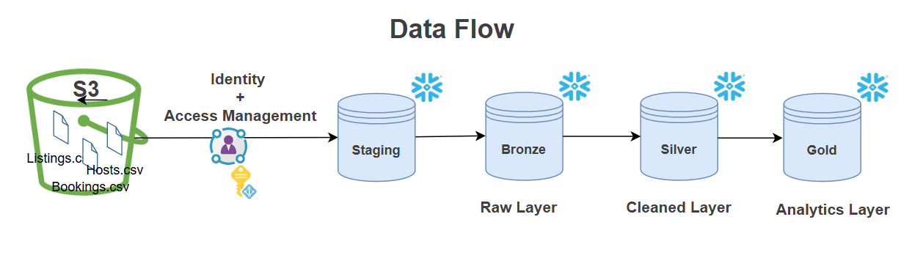
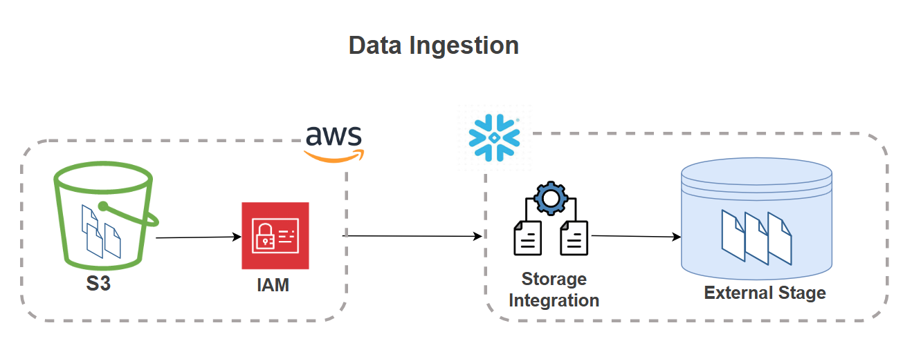
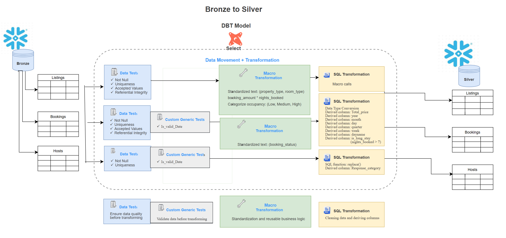
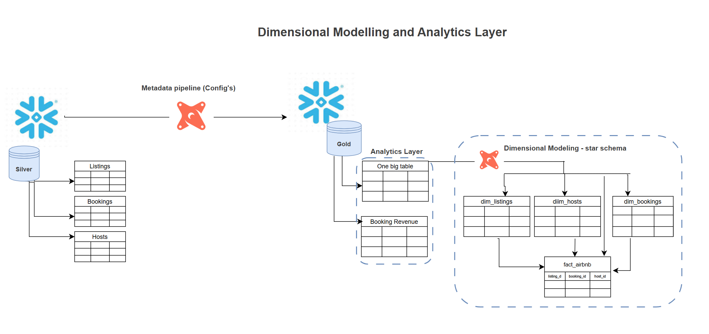

<!-- ===================================================== -->
<!-- TABLE OF CONTENTS -->
<!-- ===================================================== -->

<details open>
<summary><h2>📚 Table of Contents</h2></summary>

- [DBT + AWS + Snowflake Data Engineering Project - Airbnb](#dbt--aws--snowflake-data-engineering-project---airbnb)
  - [Project Overview](#project-overview)
  - [Architecture](#architecture)
    - [Data Flow Diagram](#data-flow-diagram)
    - [Technologies Used](#technologies-used)
  - [Data Pipeline Layers](#data-pipeline-layers)
    - [Medallion Architecture](#medallion-architecture)
      - [Ingestion](#ingestion)
      - [Bronze Layer (Raw Data)](#bronze-layer-raw-data)
      - [Silver Layer (Cleaned Data)](#silver-layer-cleaned-data)
      - [Gold Layer (Analytics)](#gold-layer-analytics)
    - [Snapshots (Slowly chanding dimensions- Type 2)](#snapshots-slowly-chanding-dimensions--type-2)
- [Project Structure](#project-structure)
- [Key Features](#key-features)
- [dbt Commands](#dbt-commands)
- [Snowflake Configuration](#snowflake-configuration)

</details>

---

# DBT + AWS + Snowflake Data Engineering Project - Airbnb

---

## Project Overview


This project demonstrates an end-to-end modern data engineering workflow using **dbt**, **Snowflake**, and **AWS-integrated architecture** principles. The goal of the project is to build scalable, modular, and production-style data transformation pipelines while following software engineering best practices such as version control, environment management, testing, logging, and documentation.

The project simulates a real-world analytics engineering environment where raw data is transformed into trusted analytical models using medallion architecture (Bronze - Silver - Gold) layered dbt transformations.

## Architecture 
### Data Flow Diagram

The following diagram illustrates the end-to-end data flow of aws + dbt + Snowflake pipeline.




### Technologies Used

| Category | Technologies | Usage |
|---|---|---|
| Cloud Data Warehouse | Snowflake | Compute  & Storage |
| Cloud Storage | AWS  - S3, IAM | Storage, Identity and access management integration  |
| Transformation Framework | dbt Core (Data Build Tool) | modular coding, incremental models, snapshots (SCD Type 2) and custom macros for testing |
| Programming & Query Languages | SQL, Jinja | dynamic sql code data transformation and reusability |
| Python | version 3.12+ | interpreter |
| Scripting & Automation | PowerShell | environment variable management and dbt target switching |
| Configuration | YAML | configure model sources, table properties, data tests and environment variables |
| Version Control | Git & GitHub | project tracking and managing conflicts |
| IDE & Development Tools | VS Code | organize project, edit code, and debug |
| Documentation & Visualization | Markdown, draw.io | Created read me files and architecture diagrams

---
## Data Pipeline Layers
### Medallion Architecture
#### Ingestion

- .csv files are staged for accessing
- secure access using snowflake **integration object** and **aws trust policy**

#### Bronze Layer (Raw Data)

Raw data ingested from stage
- 'bronze_bookings' - raw booking transactions
- 'bronze_hosts' - raw host data
- 'bronze_listings' - raw property listing data

#### Silver Layer (Cleaned Data)
Data quality check, cleaned and standardised data

- 'silver_bookings' - check for unique, null, valid dates, values in range and referential integrity 
                    - data type conversion
                    - derived columns for analytics use
- 'silver_hosts' - check for unique, null, valid dates
                 - derived columns for qualitative analysis
- 'silver_listings' - check for unique, null, valid dates and referential integrity 
                    - derived column for downstream usage

#### Gold Layer (Analytics)
Analytics layer

-'one big table' - denormalized fact table  joining with bookings, hosts and listings
- 'booking_revenue' - for metrics and analysis related to bookings
- 'fact_airbnb' - Fact table for dimensional model
- ephimeral models for downstream usage

### Snapshots (Slowly chanding dimensions- Type 2)
Tracking historical data
- 'dim_bookings' - historical data for boolings
- 'dim_hosts' - historical data for hosts
- 'dim_listiings' - historical data for listings

---
# Project Structure

```bash
├── models/
├── macros/
├── tests/
├── seeds/
├── snapshots/
├── analyses/
├── logs/
├── target/
└── diagrams/
```


---

# Key Features

- Modular dbt models
- Environment switching
- Automated testing
- Documentation generation

---

# dbt Commands

```bash
dbt debug
dbt run
dbt test
dbt docs generate
dbt docs serve
```

---

# Snowflake Configuration

Document environment variables and Snowflake setup.


